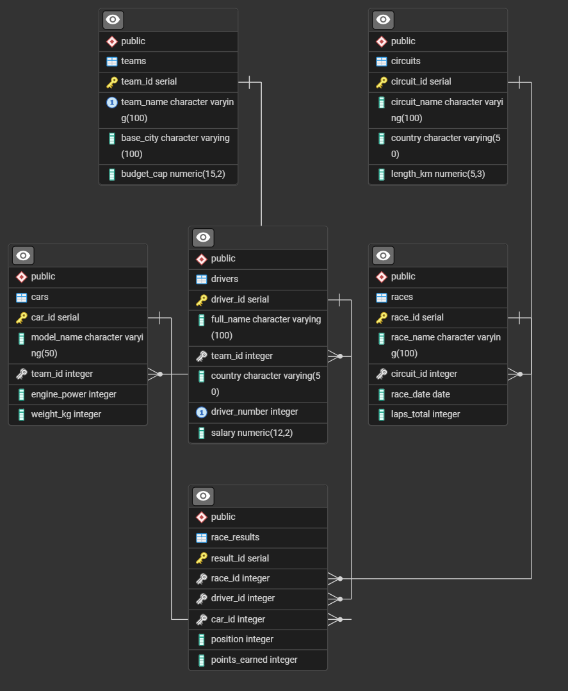
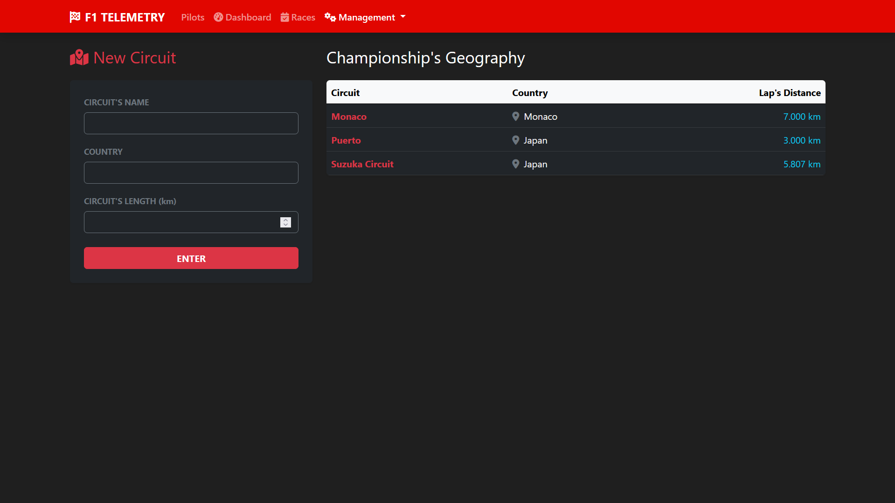
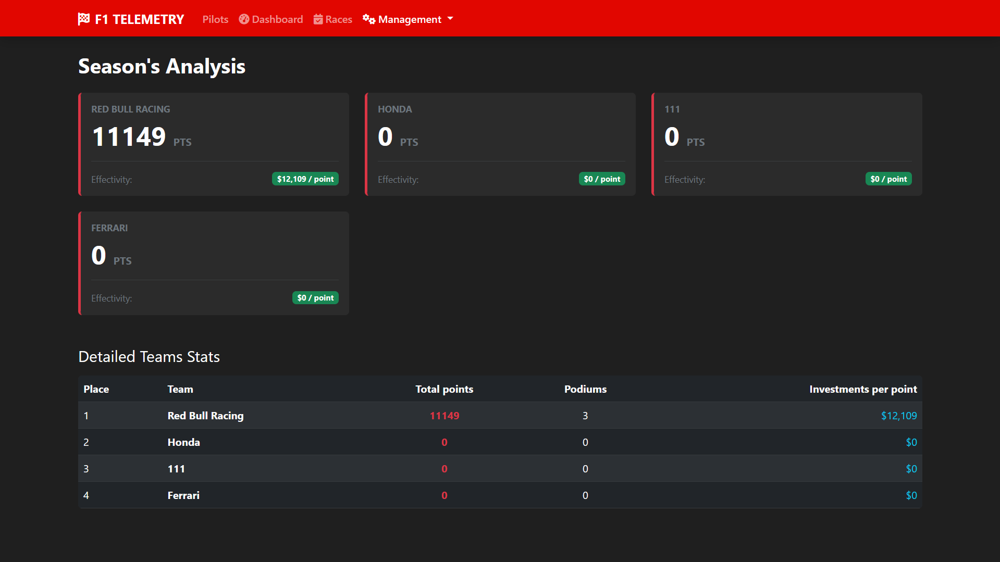
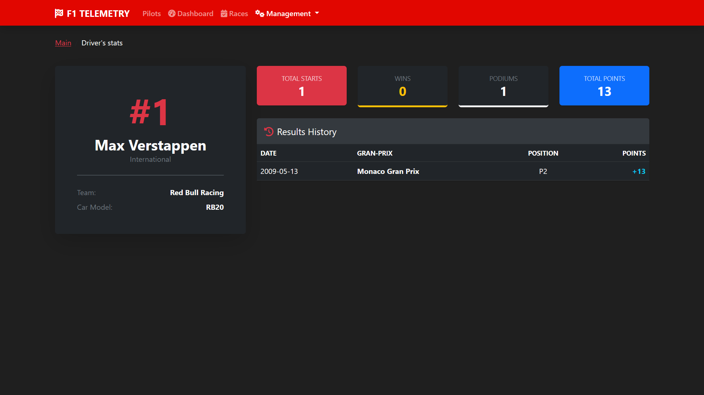
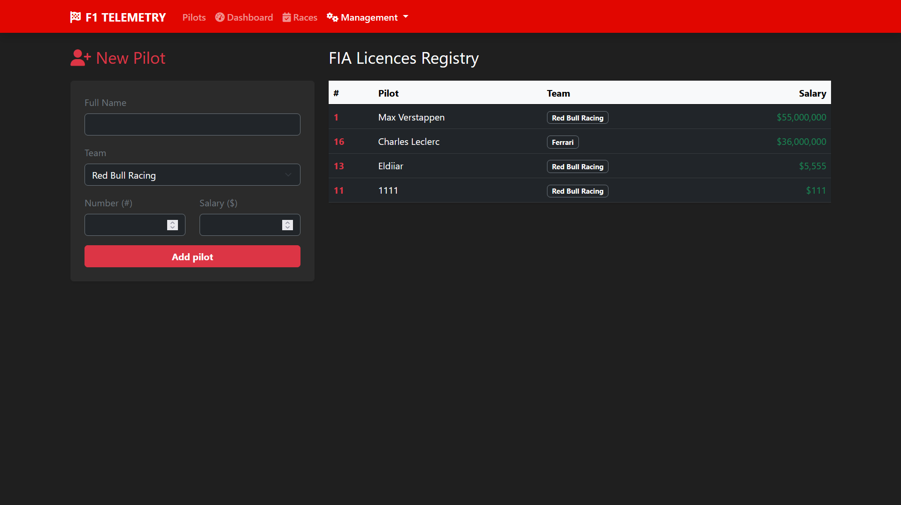
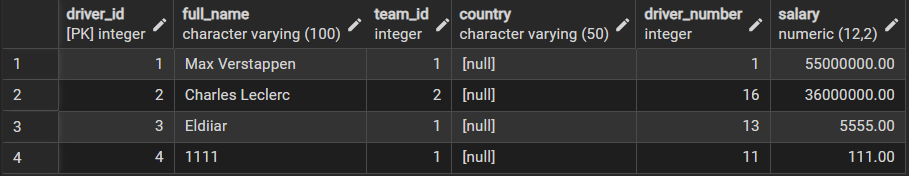

# F1 Driver Management System

The current issue for most of the Formula 1 fans all over the world is difficulties in tracking current teams and drivers points and standings on the championship.
This web application is for managing Formula 1 championship data. The system allows you to track driver and team information, as well as visualize current standings in the Drivers' and Constructors' Championships in real time.

## Demo Video
https://drive.google.com/drive/folders/1QgtyZAzmbHC6t1j_8qf_25MJh4OMApAp

## Main Functions

* **Team and Driver Management**: Complete control over the team roster, including registration of driver numbers, salaries and car specifications.
* **Interactive Dashboard**: Automatically calculates total points, podiums and unique metrics.
* **Championship Geography**: Manage the geography of races by linking specific Grand Prix to existing circuits and tracks.
* **Detailed driver statistics**: Drivers' personal pages with a full history of their performances and key indicators (wins, podiums, points).

## Tech Stack

* **Backend**: Python 3.10+, Flask
* **Database**: PostgreSQL
* **Frontend**: Bootstrap 5, HTML5, CSS3

---

## Project Structure

```text
f1-driver-management-system/
├── docs/                   # Project documentation (ERD schema, presentation)
│   └── img/                # Visual assets and screenshots
├── sql/                    # Database initialization scripts (DB tables and views init)
├── src/                    # Backend source code
│   ├── app.py              # Application core and Flask routing
│   └── database.py         # Database connection and queries utility
└── templates/              # Frontend HTML views and administrative dashboards
```
---

## Boot

### 1. 1. Cloning of the repository
```bash
git clone https://github.com/matorafull/f1-driver-management-system
cd f1-management-system
```

# Environment setup
```bash
python -m venv venv
# For Windows:
venv\Scripts\activate
# For Linux/Mac:
source venv/bin/activate

pip install flask psycopg2-binary
```

### 3. Database setup
1. Create a database in PostgreSQL called *f1_racing_db*
2. Open the Query Tool and run the commands in the init_sql.sql file to create the tables.
3. When you first launch SQLAlchemy, it will automatically create all the necessary tables based on the described models.

### 4. Boot
Execute the line in the root directory:
```bash
python3 app.py
```
---

## Datbase design

### 1. Entities and Tables
(PK = Primary Key)

* **`circuits`** — Directory of racing tracks and autodromes.
  * `circuit_id` (PK)
  * `circuit_name` (VARCHAR, NOT NULL)
  * `country` (VARCHAR, NOT NULL)
  * `length_km` (NUMERIC)
* **`teams`** — Data on Formula 1 teams and their financial baselines.
  * `team_id` (PK)
  * `team_name` (VARCHAR, NOT NULL)
  * `base_city` (VARCHAR)
  * `budget_cap` (NUMERIC)
* **`drivers`** — Register of pilot licenses and their active contracts.
  * `driver_id` (PK)
  * `full_name` (VARCHAR, NOT NULL)
  * `driver_number` (INTEGER)
  * `salary` (NUMERIC)
  * `team_id` (FK)
* **`cars`** — Technical parameters of the racing cars assigned to the teams.
  * `car_id` (PK)
  * `model_name` (VARCHAR, NOT NULL)
  * `team_id` (FK)
* **`races`** — Calendar of planned Grand Prix events for the season.
  * `race_id` (PK)
  * `race_name` (VARCHAR, NOT NULL)
  * `race_date` (DATE)
  * `circuit_id` (FK)
* **`race_results`** — Archive of finishing protocols and championship points scored.
  * `result_id` (PK)
  * `race_id` (FK)
  * `driver_id` (FK)
  * `car_id` (FK)
  * `position` (INTEGER)
  * `points_earned` (NUMERIC)

---

### 2. Relationships (Foreign Key Constraints)
The database enforces referential integrity through the following relationships:
* **`teams` ➔ `drivers`** (One-to-Many)
* **`teams` ➔ `cars`** (One-to-Many)
* **`circuits` ➔ `races`** (One-to-Many)
* **`race_results` ➔ `Functions`** (Many-to-Many): The `race_results` table acts as a bridge connecting `races`, `drivers`, and `cars`.

---

### 3. Database Schema Diagram



## Sample Queries and Their Purpose
For initial/sample queries and their purpose refer to ```sql/init_sql.sql```

## Screenshots Gallery







---
**Developer:** Eldiiar Sadykov 
**Developed for the Databases course at AUCA**
